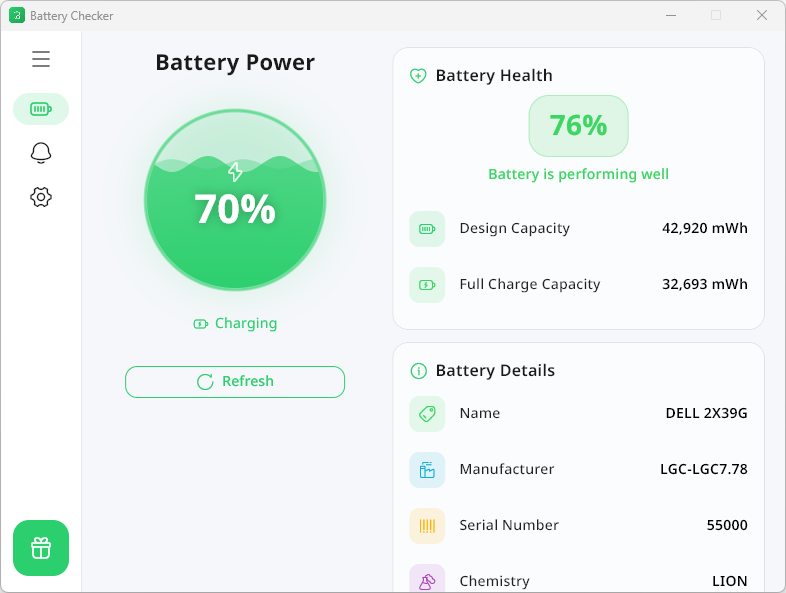

<p align="center">
  
</p>

<h1 align="center">Battery Health Checker</h1>

<p align="center">
  <strong>A beautiful, open-source Windows desktop app to monitor your laptop battery health.</strong>
</p>

<p align="center">
  <a href="https://flutter.dev"></a>
  <a href="https://dart.dev"></a>
  <a href="LICENSE"></a>
  <a href="https://github.com/LotfiBoukhemerra/Battery-Health-Checker/releases"></a>
  <!-- <a href="https://github.com/LotfiBoukhemerra/Battery-Health-Checker/stargazers" title="Star"></a>
  <a href="https://github.com/LotfiBoukhemerra/Battery-Health-Checker/network/members" title="Fork"></a> -->
 
</p>
<div align="center">
  
[](https://www.paypal.com/paypalme/LotfiBoukhemerra) [](https://ko-fi.com/lotfibkmr)
</div>
---

## ✨ Features

| Feature | Description |
|---------|-------------|
| 🎨 **New UI** | A beautiful, modern user interface with smooth animations and intuitive navigation. |
| 🔋 **Real-time Monitoring** | Live battery level, charging state, and health percentage |
| 📊 **Health Analysis** | Design vs. full-charge capacity comparison with color-coded status |
| 🔔 **Smart Alerts** | Configurable low/high battery notifications via Windows toast |
| 🖥️ **System Tray** | Minimize to tray to keep monitoring in the background |
| 🚀 **Start with Windows** | Auto-launch at login via the Windows Registry |
| 🌍 **Multi-language** | English, Arabic, and Spanish |
| 🎨 **Themes** | Light, dark, and system-follow modes |
| 🔄 **Auto-update Check** | Checks GitHub Releases for new versions on startup |

## 📸 Screenshots





## 🏗️ Architecture

The project follows a **clean architecture** pattern with clear separation of concerns:

```
lib/
├── core/               # Shared utilities, themes, services, constants
│   ├── constants/      # App-wide colors (AppColors) and constants
│   ├── l10n/           # Localization strings (EN, AR, ES)
│   ├── services/       # Tray, notification, startup, and update services
│   ├── theme/          # Light/dark theme definitions & ThemeProvider
│   ├── utils/          # Battery utility helpers
│   └── widgets/        # Reusable widgets (GlassCard, AppErrorWidget)
├── data/               # Data layer
│   ├── datasources/    # Windows battery data source (powercfg parser)
│   └── repositories/   # Repository implementations (Battery, Settings)
├── domain/             # Domain layer
│   ├── entities/       # BatteryInfo entity
│   └── repositories/   # Abstract repository interfaces
├── presentation/       # UI layer
│   ├── pages/          # Screens (Battery, Alerts, Settings)
│   ├── providers/      # ChangeNotifier state (Battery, Alerts, Update)
│   └── widgets/        # UI components (WaveBatteryIndicator, DonateMenu, etc.)
└── main.dart           # App entry point and window setup
```

### Key Design Decisions

- **State Management**: Built-in Flutter `ChangeNotifier` + `ListenableBuilder` — no third-party state packages.
- **Battery Data**: Uses `powercfg /batteryreport` to generate an HTML report, then parses it with the `html` package to extract health data.
- **Design System**: All colors are centralized in [`app_colors.dart`](lib/core/constants/app_colors.dart) for easy theming.
- **Typography**: Uses bundled [Noto Sans Arabic](https://fonts.google.com/noto/specimen/Noto+Sans+Arabic) fonts for multi-script support (Latin + Arabic) without runtime network requests.
- **Update Checking**: Queries the GitHub Releases API on startup and notifies the user if a newer version is available.
- **Window Management**: Dynamic window height (70% of screen height, clamped to 600 px) adapts to different displays and DPI scaling.
- **Background Optimization**: Animations are paused via `TickerMode` when the window is minimized or hidden to reduce CPU usage.

## 🚀 Getting Started

### Prerequisites

- **Flutter SDK** `3.41+` (stable channel)
- **Dart SDK** `3.11+`
- **Windows 10/11** with a laptop battery
- **Git** for cloning the repository

### Option 1: Using Flutter directly

```bash
# 1. Clone the repository
git clone https://github.com/LotfiBoukhemerra/Battery-Health-Checker-App.git
cd Battery-Health-Checker-App

# 2. Install dependencies
flutter pub get

# 3. Run in debug mode
flutter run -d windows

# 4. Build a release executable
flutter build windows --release
```

The release build will be located at:
```
build/windows/x64/runner/Release/
```

### Option 2: Using FVM (Flutter Version Management)

If you manage multiple Flutter versions with [FVM](https://fvm.app):

```bash
# 1. Install FVM (if not already installed)
dart pub global activate fvm

# 2. Clone and enter the project
git clone https://github.com/LotfiBoukhemerra/Battery-Health-Checker-App.git
cd Battery-Health-Checker-App

# 3. Install the required Flutter version
fvm install 3.41.7
fvm use 3.41.7

# 4. Install dependencies and run
fvm flutter pub get
fvm flutter run -d windows
```

### Option 3: Using Puro

[Puro](https://puro.dev) is a blazing-fast Flutter version manager:

```bash
# 1. Install Puro
dart pub global activate puro

# 2. Create an environment with the required Flutter version
puro create battery_checker stable

# 3. Clone and enter the project
git clone https://github.com/LotfiBoukhemerra/Battery-Health-Checker-App.git
cd Battery-Health-Checker-App

# 4. Use the Puro environment
puro use battery_checker

# 5. Install dependencies and run
flutter pub get
flutter run -d windows
```

## 🧪 Running Tests

```bash
flutter test
```

## 📦 Dependencies

| Package | Purpose |
|---------|---------|
| [`battery_plus`](https://pub.dev/packages/battery_plus) | Real-time battery level and charging state |
| [`window_manager`](https://pub.dev/packages/window_manager) | Window size, minimize/close behavior |
| [`system_tray`](https://pub.dev/packages/system_tray) | System tray icon and context menu |
| [`local_notifier`](https://pub.dev/packages/local_notifier) | Windows toast notifications |
| [`shared_preferences`](https://pub.dev/packages/shared_preferences) | Persistent user settings |
| [`hugeicons`](https://pub.dev/packages/hugeicons) | Modern icon set |
| [`html`](https://pub.dev/packages/html) | Parsing powercfg battery report HTML |
| [`url_launcher`](https://pub.dev/packages/url_launcher) | Opening external links |
| [`http`](https://pub.dev/packages/http) | GitHub Releases API for update checking |
| [`intl`](https://pub.dev/packages/intl) | Internationalization utilities |

## 🤝 Contributing

Contributions are welcome! Here's how to get started:

1. **Fork** the repository
2. **Create** a feature branch: `git checkout -b feature/my-feature`
3. **Commit** your changes: `git commit -m "Add my feature"`
4. **Push** to your fork: `git push origin feature/my-feature`
5. **Open** a Pull Request

### Guidelines

- Follow the existing code style and architecture patterns
- All colors must be defined in [`app_colors.dart`](lib/core/constants/app_colors.dart)
- Add documentation comments to all public APIs
- Run `flutter analyze` before submitting

## 💖 Support the Project

If this app helps you, consider supporting its development:

| Platform | Link |
|----------|------|
| 💳 **PayPal** | [paypal.me/LotfiBoukhemerra](https://www.paypal.com/paypalme/LotfiBoukhemerra) |
| ☕ **Ko-fi** | [ko-fi.com/lotfibkmr](https://ko-fi.com/lotfibkmr) |

Every contribution — no matter how small — helps keep this project alive and growing. Thank you! 🙏

## 📄 License

This project is licensed under the [Creative Commons Attribution-NonCommercial-ShareAlike 4.0 International (CC BY-NC-SA 4.0)](https://creativecommons.org/licenses/by-nc-sa/4.0/) license.

You are free to share and adapt this project for non-commercial purposes, as long as you give appropriate credit and distribute your contributions under the same license. See the [LICENSE](LICENSE) file for details.

## Author

**Lotfi Boukhemerra**

- Website: [batterychecker.org](https://batterychecker.org)
- GitHub: [@LotfiBoukhemerra](https://github.com/LotfiBoukhemerra)

---

<p align="center">
  Made with ❤️ using Flutter
</p>
